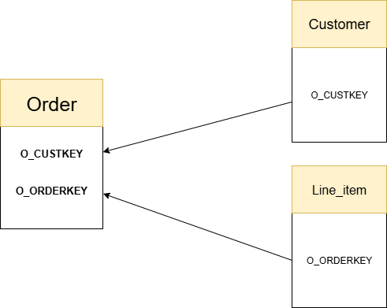
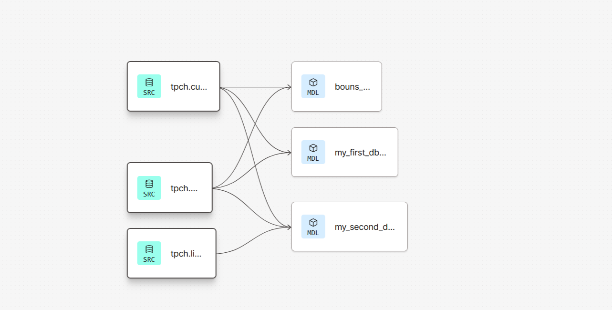

Snowflake & DBT Data Engineering Assessment
Project Overview

This project demonstrates a modern data engineering workflow using Snowflake as the data warehouse and dbt (data build tool) for transformation, testing, and documentation. The implementation follows medallion architecture principles to build reliable, tested data models from TPCH sample data.
Architecture & Setup
Platform Integration

    Snowflake Account: Configured with access to TPCH sample datasets

    dBT Cloud: Connected to Snowflake for transformation workflows

    GitHub Repository: Version-controlled data models and configurations

    End-to-End Pipeline: Established seamless integration between all platforms

Data Source Analysis

Before model development, I conducted thorough data exploration:

    Extracted sample records from customer, orders, and lineitem tables

    Analyzed table relationships and data integrity

    Created Entity-Relationship Diagrams (ERD) to visualize data relationships

    Verified join conditions and business logic requirements

## Screenshot of the ERD

## Screenshot of the Graph from DBT website

Data Models Implementation
Source Configuration (schema.yml)

Defined structured sources for raw TPCH schema tables with comprehensive documentation:

    customer - Master customer data table

    orders - Customer order transactions

    lineitem - Order line item details

    Implemented referential integrity tests and null checks

Transformation Layers
Silver Layer: stg_orders

    Purpose: Enriched orders data with customer information

    Business Logic:

        Joined orders with customers to append customer names

        Derived order_year from order dates using date functions

        Maintained total_price from source tables

    Data Quality: Implemented dbt tests for unique and non-null order keys

Gold Layer: customer_revenue

    Purpose: Customer-level revenue aggregation

    Business Logic:

        Joined orders and lineitem tables on order keys

        Calculated total revenue: SUM(l_extendedprice * (1 - l_discount))

        Grouped by customer key and name for business-friendly reporting

    Data Quality: Primary key not-null validation tests

Extended Models

Developed additional analytical models expanding beyond core requirements:

    Integrated nation and region tables for geographical analysis

    Implemented customer segmentation and ordering patterns

    Added time-based aggregations for historical trend analysis

Quality Assurance
Comprehensive Testing Strategy

    Implemented data quality tests directly in schema configurations

    Validated referential integrity between related tables

    Ensured data completeness through null checks

    Verified business logic through structured test cases

Validation Workflow

    Executed dbt commands to test model functionality

    Verified data pipeline integrity end-to-end

    Confirmed transformation accuracy against business requirements

Technical Achievements

✅ End-to-End Platform Integration: Connected Snowflake, dBT Cloud, and GitHub
✅ Medallion Architecture Implementation: Bronze (raw), Silver (cleaned), Gold (business) layers
✅ Data Quality Framework: Built-in testing and validation
✅ Documentation-Driven Development: Self-documenting data models
✅ Scalable Data Models: Modular, reusable SQL transformations
✅ Professional Standards: Production-ready code with proper version control
